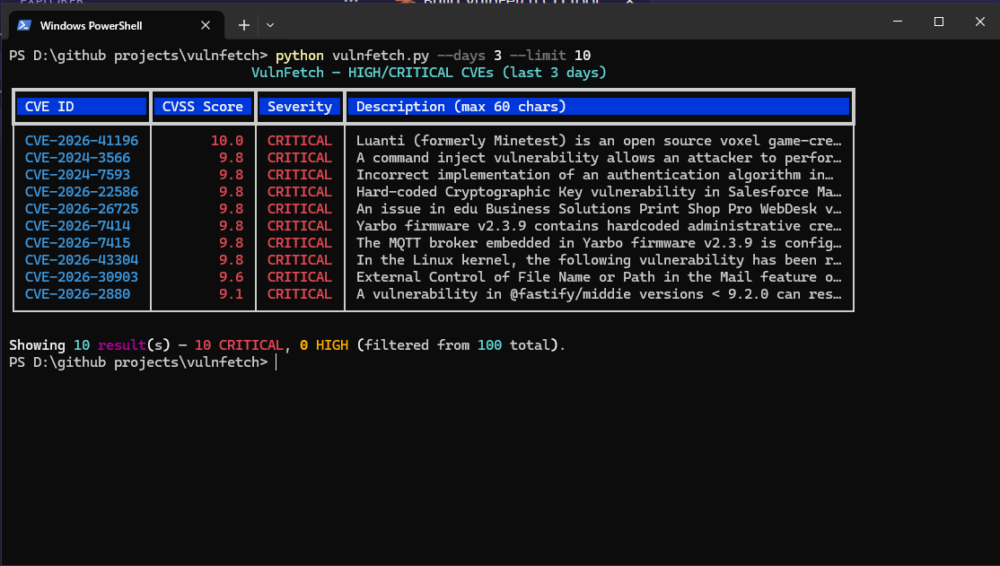

# VulnFetch

A small CLI that fetches recent **HIGH** and **CRITICAL** CVEs from the [NVD API](https://nvd.nist.gov/developers/vulnerabilities) and renders them in a colored terminal table using [Rich](https://github.com/Textualize/rich).

 

## Features

- Queries the official NVD CVE 2.0 API for vulnerabilities modified in a configurable lookback window.
- Filters to **CVSS base score ≥ 7.0** (HIGH and CRITICAL), preferring CVSS v3.1 → v3.0 → v2.
- Renders results in a Rich table with color-coded severity (red for CRITICAL, orange for HIGH).
- Sorts by CVSS score descending; truncates descriptions to 60 characters for readability.
- Robust error handling for timeouts, rate limits (403/429), connection failures, and malformed responses.
- Optional NVD API key support to raise rate limits.

## Installation

```bash
git clone https://github.com/pashasec/vulnfetch.git
cd vulnfetch
pip install -r requirements.txt
```

Requires Python 3.9+.

## Usage

```bash
# Default: last 7 days, up to 25 results
python vulnfetch.py

# Last 3 days, top 15 results
python vulnfetch.py --days 3 --limit 15

# Use an NVD API key (raises rate limit from 5 to 50 req / 30s)
python vulnfetch.py --api-key YOUR_NVD_KEY
```

### Flags

| Flag | Default | Description |
|------|---------|-------------|
| `-d`, `--days` | `7` | Lookback window in days (clamped to 1–120). |
| `-n`, `--limit` | `25` | Maximum number of rows to display. |
| `--api-key` | — | Optional NVD API key. Request one at [nvd.nist.gov/developers/request-an-api-key](https://nvd.nist.gov/developers/request-an-api-key). |

## Sample Output



## Exit Codes

| Code | Meaning |
|------|---------|
| 0 | Success |
| 2 | Timeout / connection error |
| 3 | Rate-limited (403 / 429) |
| 4 | Other HTTP error |
| 5 | Generic network error |
| 6 | Malformed API response |
| 130 | Aborted by user (Ctrl+C) |

## License

MIT
